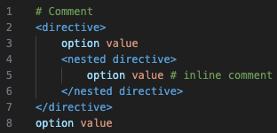

# pmta-conf

### This extension is used to provide syntax highlighting to PowerMTA configuration files.

When PMTA config files get big enough, they become a massive pain to manage. This extension hopes to make things easier by syntax highlighting most of a PMTA config file, with the following in mind:

* Comments, both single and in-line
* Opening and closing tags for different directives
* Nested opening and closing tags for different directives
* General options/directives and their respective values

Example:

This extension is licenced under the GNU General Public License v3.0 (GPLv3.0). Please see the [license](LICENSE) file for reference.